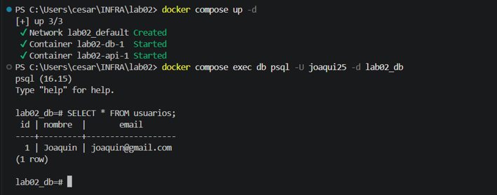
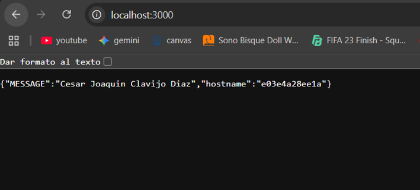
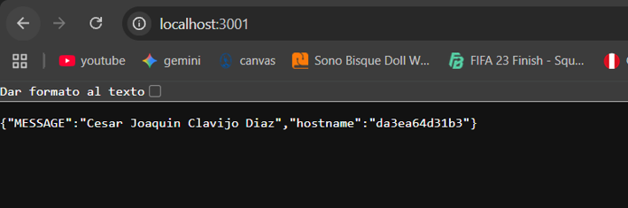
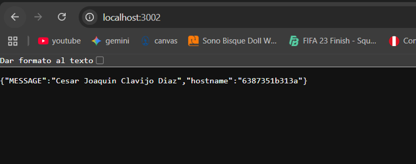

# Laboratorio2 ejercicio Docker Compose
Tarea de laboratorio para deplegar una API replicada 3 veces y una base de datos persistente mediante Docker Compose.
### Estructura y Stack
* **API**: Node.js con Express
  * Construcción local mediante Dockerfile.
  * Escalada a 3 réplicas con rango de puertos del host (3000-3002).
* **Base de Datos**: PostgreSQL 16
  * Persistencia de datos mediante un volumen nombrado (db_data).
* **Orquestación**: Docker y Docker Compose.
   * Gestión y despliegue unificado del stack.
### Requisitos previos
* **Docker Desktop:** Tiene que estar instalado y ejecutandose.
* **Git.** : Iniciado sesión con tu cuenta.
### Despliegue
Pasos para clonar, configurar y levantar el entorno de manera local:

* **Clonar el repositorio y acceder al proyecto:**

   ```bash
   git clone https://github.com/j0aquin25/lab02.git
   cd lab02
   ```
* **Configurar entorno**: Se tiene que abrir el archivo .env y reemplazar los valores por los propios
  * Windows
  ```bash
  Copy-Item .env.example .env
  ```
  * Linux/Mac
  ```bash
  cp .env.example .env
  ```
* **Levantar y construir los servicios:**
  ```bash
  docker compose up -d --build
  ```
* **Ver estado de los contenedores**:
  ```bash
  docker compose ps
  ```
* **Revisar logs de la API**:
  ```bash
  docker compose logs api
  ```
* **Detener y limpiar el entorno**:
  * Para detener conservando los datos
  ```bash
  docker compose down
  ```
  * Para detener y eliminar el volumen
  ```bash
  docker compose down -v
  ```
### Variables de Entorno

Estas variables se definen dentro del archivo `.env`, el cual no se encuentra en Git por razones de seguridad. Por eso existe la plantilla `.env.example` como guía de configuración:

| Variable | Definición 
|---|---
| `MESSAGE` | Texto que devuelve la API 
| `PORT` | Puerto en el que escucha la API dentro del contenedor 
| `POSTGRES_USER` | Usuario que Postgres crea automáticamente al inicializarse 
| `POSTGRES_PASSWORD` | Contraseña asignada al usuario de la base de datos  
| `POSTGRES_DB` | Nombre de la base de datos creada en el primer arranque 

## Preguntas Teoricas
### Tipos de redes en Docker

* **Bridge:** Es el driver por defecto (usado en esta laboratorio). Red privada donde los contenedores se comunican entre sí vía NAT.
* **Host:** Usa directamente la red de la PC sin aislamiento. Es más rápido, pero hace imposible réplicas por choque de puertos.
* **None:** Brinda aislamiento total. Desactiva la red y solo deja la interfaz `localhost`.
* **Overlay:** Conecta contenedores repartidos en distintos servidores físicos (usado en Docker Swarm).
* **Macvlan:** Asigna una dirección MAC propia para simular que el contenedor es un dispositivo físico en la red local.
* **Ipvlan:** Similar a Macvlan, pero comparte la MAC del host y solo varía la dirección IP.

### Tipo de volumenes en Docker
En docker existen tres formas de gestionar el almacenamiento de datos:

* **Volúmenes nombrados:** Docker los crea y gestiona en el host por nombre. Estos persisten aunque se eliminen los contenedores.
* **Bind mounts:** Enlazan una ruta de la máquina local con el contenedor. Son ideales para desarrollo en vivo, pero dependen de la estructura de carpetas del host.
* **tmpfs:** Guardan los datos en la RAM del host sin tocar el disco. Se borran al detener el contenedor.

### Capturas
* **Persistencia del volumen tras destruir los contenedores**

* **Las tres réplicas responden con hostname distinto**




### Datos del estudiante
* **Apellido y Nombres**: Clavijo Diaz, Cesar Joaquin
* **ID**: 000290784